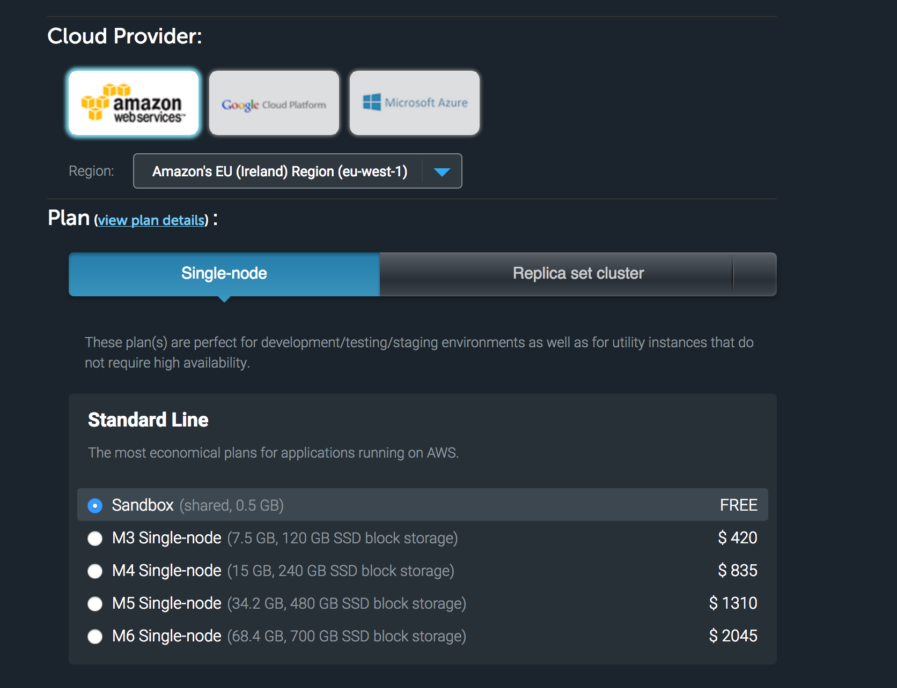
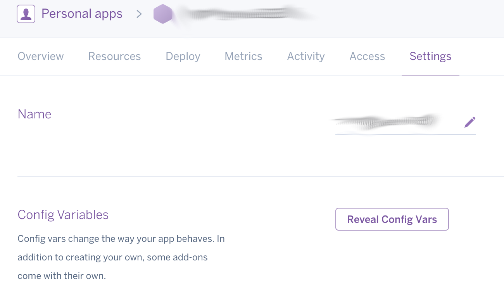

# mongo-mlab
example to work with mlab and heroku for a "free"-ish server sandbox

## requirements
1. Register at [mlab](mlab.com/signup) and [heroku](heroku).
2. Create a mongo instance with the following settings (adjusting to a region near you)


3. Give it a name
4. Add a dbuser once it is created
5. Enter your settings in the Heroku environment variables

6. Or locally change the settings.

```bash
cp settings.json.example settings.json
```

Run npm start and bob's your uncle
